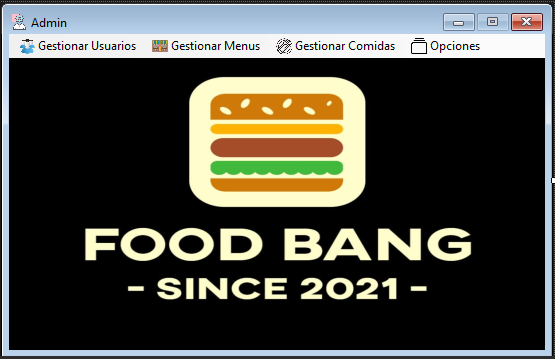

# FoodBang

---

## Tecnologías Utilizadas

- C#
- .NET Framework
- PostgreSQL

---

## Descripción

Este es un pequeño proyecto de Windows Forms que trata de replicar la aplicación de Uber Eats.

La app permite gestionar los menús y comidas de ciertos restaurantes, está pensada para trabajar sólo con los 6 restaurantes que están por defecto y gestionar sus menús y las comidas de estos.

---

Hay 2 tipos de usuarios:

- Administrador
- Cliente

---

Para entrar como administrador hay que logearse con el usuario "admin", para el menú de cliente el usuario es "user" y contraseña "1234" para ambos.

El usuario administrador tiene un menú donde puede consultar los datos de todos los usuarios de la app y modificarlos, así como los menús y las comidas.

---

El usuario cliente puede escoger y agregar a su pedido comidas de los menús de los diferentes restaurantes.

Luego se procede a una pantalla que simula el envío del pedido por medio de un temporizador que va controlando y pintando unas "progressbar" y muestra la factura con todos los datos de la transacción, y en caso que sea necesario, puedes imprimirla.

Luego se puede salir y hacer otra transacción o terminar la ejecución del programa.

---

En el repo se encuentra el BackUp de la BD